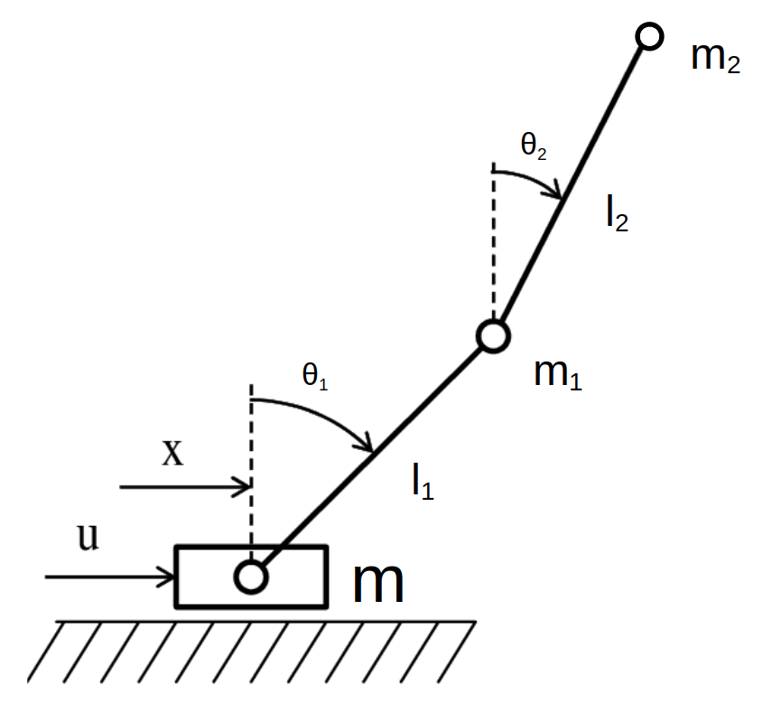

# Trajectory Optimization: inverted double-pendulum on a cart via MPPI and DDP

## Introduction
This repo explores the feasibility of two optimal
control methods widely used in robotics as trajectory planners
for dual pendulum systems, which are nonlinear systems. The
first method is DDP, which uses second-order approximations
along nominal trajectories and shows quadratic convergence to
local solutions. The second method is Model Predictive Path
Integral Control (MPPI), a random sampling-based algorithm
that can be optimized for general cost criteria, including
potentially highly nonlinear formulations. The results show
that both methods were able to successfully control a double
pendulum to the desired position.

[project report](Project_Report_DDP.pdf)

## Demo
You can run the following command to run the demo of our code. The result will be stored as a gif file.
```
python demo.py
```


## Dynamics Model


## Reference
* iLQR: https://homes.cs.washington.edu/~todorov/papers/TassaIROS12.pdf
* DDP: https://arc.aiaa.org/doi/abs/10.2514/6.2022-0624